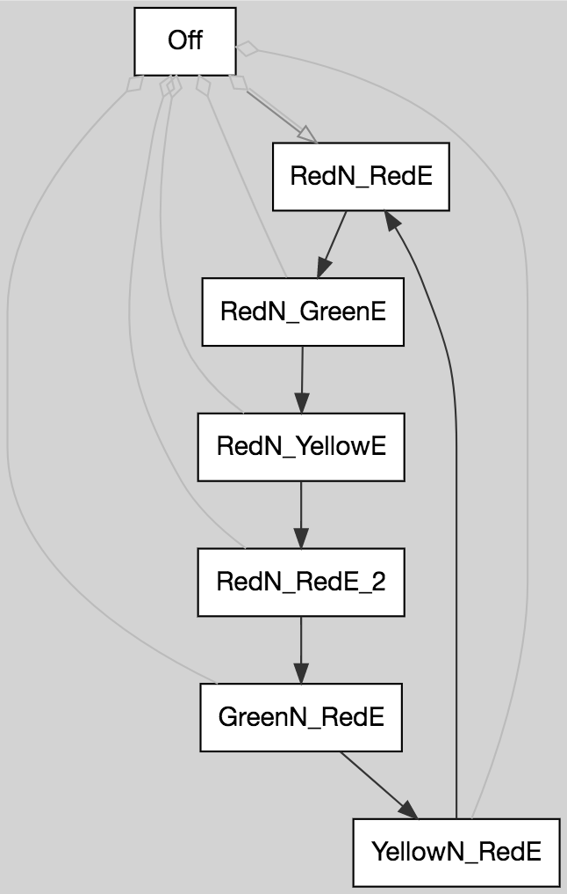
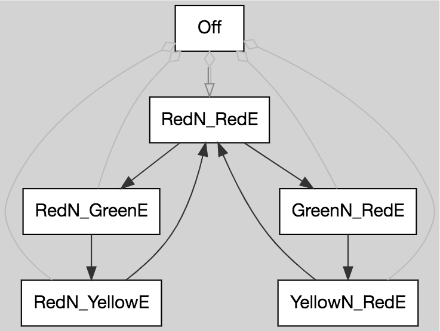

# Let's follow along

Open a [graph explorer](https://stonecypher.github.io/jssm-viz-demo/graph_explorer.html) if you like, 
to generate these images from this code as we go.


<br/><br/>

# Just the three colors

First we start with the simple three colors `Red` `Yellow` and `Green`, using the main path `=>` symbol to draw them.

```
Green => Yellow => Red => Green;
```


<br/><br/>

# We need an off state

So let's try adding a rule that creates an off state, that turns to red.  We'll mark that a "legal" instead of a main path, with `->`; it's not expected to be a common part of operation, since the light should rarely be turned off.

```
Off -> Red;
Green => Yellow => Red => Green;
```


<br/><br/>

# We can turn on, but not back off

All colors should be able to turn off.  It should be a "forced" transition, to indicate that it is considered an extreme and generally unwanted rarity, since we should almost never do it.  Forced transitions are written with `~>`.

```
Off -> Red;
Green => Yellow => Red => Green;
[Red Yellow Green] ~> Off;
```


<br/><br/>

# Intersections are four lights, not one

We could try to make an individual light then build intersections out of that, but it's
simpler to just model the whole intersection directly.

A basic four-way intersection could be written, for example, by the color of the north 
light and the color of the east light.  Say, `GreenN_RedE` for an intersection where the
north/south lane was `Green`, and the east/west lane was `Red`.  Then you'd end up with
a machine like this:

```
Off -> RedN_RedE;

RedN_RedE => RedN_GreenE => RedN_YellowE => RedN_RedE_2 => GreenN_RedE => YellowN_RedE => RedN_RedE;

[RedN_GreenE RedN_YellowE RedN_RedE GreenN_RedE YellowN_RedE RedN_RedE_2] ~> Off;
```



## RedN_RedE_2

Notice that we've had to distinguish two different red/red pairs (`RedN_RedE` and `RedN_RedE_2`), so 
that the machine would know which lane was going to go `Green` afterwards.

If we didn't do that, we'd end up with this bug instead:


```
Off -> RedN_RedE;

RedN_RedE => RedN_GreenE => RedN_YellowE => RedN_RedE => GreenN_RedE => YellowN_RedE => RedN_RedE;

[RedN_GreenE RedN_YellowE RedN_RedE GreenN_RedE YellowN_RedE] ~> Off;
```


